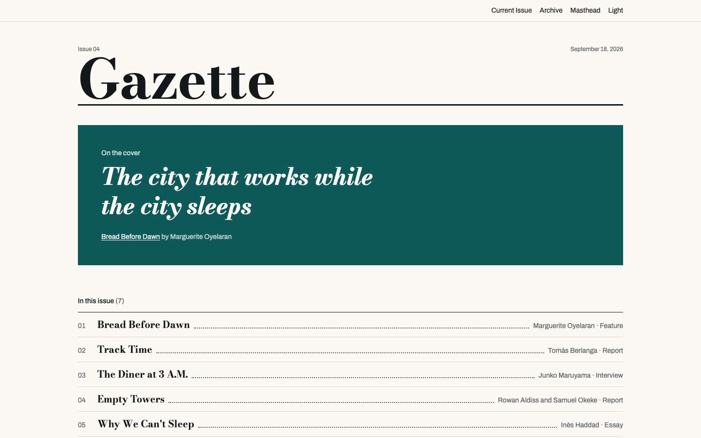

# Gazette

A weekly magazine theme for Astro, published in issues: a cover, a contents page, and room for the
long pieces. Free and MIT-licensed.

[Live demo](https://gazette-free.ondelva.com) · [Pro demo](https://gazette.ondelva.com) · [Get Pro](https://buy.polar.sh/polar_cl_k3KWUTP5hbFrrZRv5XnFIFYA2yR4ecBVxcu2d2wDLvz)



## What it is

The unit here is the **issue**, not the article. The home page is this week's cover and its
contents, not a scannable front page. The signature is the leader contents row: the number hangs in
the left margin and a dotted leader joins the title to the byline, the way a printed contents page
joins a piece to its folio. It repeats on the home page, the issue page, the archive and the foot
of a piece.

Ink, paper, and one spot colour. `--radius` is `0`: structure is drawn with rules, never with
rounded cards or shadows.

## Features

- Astro 7 + Tailwind CSS v4, static output, zero client-side JS by default
- Issue-based content model: cover line, contents order, folio, editor's note
- Cover, issue, piece, archive, masthead and 404 screens
- Dark mode, responsive from 360px
- Feed, sitemap, JSON-LD, `robots.txt`, analytics slot (Plausible or GA4)
- Lighthouse 95+ on all four categories, checked in CI
- Type-safe content collections (Markdown and MDX), and `AGENTS.md` for Claude Code / Cursor

## Quick start

You need Node.js 22.12+ and pnpm 9 or newer (`npm i -g pnpm`). `package.json` pins the exact pnpm
version, and pnpm 10+ switches to it on its own.

```sh
pnpm create astro@latest my-magazine -- --template ondelva/astro-theme-gazette
cd my-magazine
pnpm install
pnpm dev
```

`pnpm dev` also serves `/styleguide`, where every colour token and type size is on one page.

## Configure

Everything site-specific lives in `src/config.ts`: name, URL, navigation, social links, the
contents style and the feature switches. Colours, rules and spacing are tokens you override in
`src/styles/theme.css`.

- [docs/customization.md](docs/customization.md) — every config group, the tokens, the switches
- [docs/content.md](docs/content.md) — the three collections and every field
- [docs/deploy.md](docs/deploy.md) — build, hosting, CI

## Deploy

Static output. Works on Cloudflare, Vercel, Netlify and GitHub Pages. One click and the host clones
this repository into your account, builds it and puts it online:

[](https://deploy.workers.cloudflare.com/?url=https://github.com/ondelva/astro-theme-gazette)
[](https://app.netlify.com/start/deploy?repository=https://github.com/ondelva/astro-theme-gazette)
[](https://vercel.com/new/clone?repository-url=https://github.com/ondelva/astro-theme-gazette)

Set `SITE_URL` to your address afterwards. See [docs/deploy.md](docs/deploy.md).

## Free vs Pro

Gazette Pro is the same magazine with the reading apparatus around it. See it running at
[gazette.ondelva.com](https://gazette.ondelva.com), and [buy it here](https://buy.polar.sh/polar_cl_k3KWUTP5hbFrrZRv5XnFIFYA2yR4ecBVxcu2d2wDLvz) — $49 for one person,
$129 for a team of up to ten.

|                  | Free (this repo)                            | Pro                                                            |
| ---------------- | ------------------------------------------- | -------------------------------------------------------------- |
| Pages            | Cover, issue, piece, archive, masthead, 404 | + contributor pages, department indexes, legal set, search     |
| Long-form extras | Drop cap, pull-quote epigraph, folio        | + contents box, related pieces, sidebar and pull-quote for MDX |
| Search           | –                                           | Pagefind                                                       |
| Languages        | UI strings in `src/i18n/`                   | + routing, language picker, a second edition of the magazine   |
| Colour presets   | 1                                           | 4                                                              |
| Font pairings    | 1                                           | 3                                                              |
| Share cards      | One default image                           | Drawn per piece at build time                                  |
| Integrations     | Analytics (Plausible, GA4)                  | + newsletter (Buttondown, Kit), giscus comments                |
| License          | MIT                                         | Commercial, unlimited end products                             |
| Support          | GitHub Issues                               | Email (im@ondelva.com), 2 business days                        |

## Screenshots

More in [docs/screenshots/](docs/screenshots/): the cover, an issue and a piece, light and dark,
desktop and mobile.

## License

MIT, see [LICENSE](LICENSE).
Third-party assets: [THIRD-PARTY-NOTICES.md](THIRD-PARTY-NOTICES.md)
